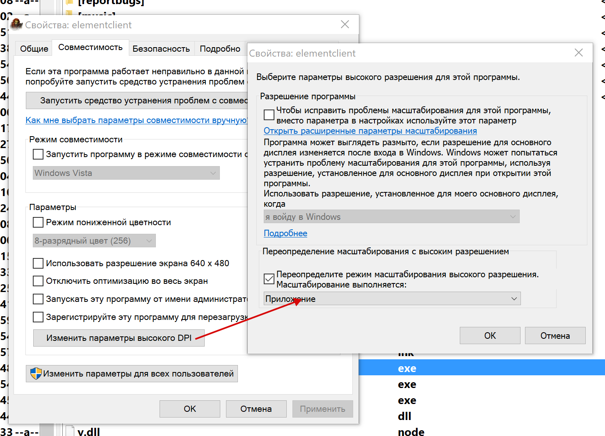

## Интерфейс Perfect World для 4k мониторов для версии игры 1.3.6 (сервер pwclassic)

Данный UI (интерфейс) предназначен только для мониторов с высоким dpi (разрешением).
Если у вас обычный монитор, элементы интерфейса будут выглядеть увеличенными в 
2 раза и плохо помещаться на экране.

Интерфейс представляет собой классический интерфейс pw с увеличенными элементами
для комфортной игры на мониторах с высоким разрешением.

### Особенности
    
  * Увеличен размер важных элементов интерфейса игры в 2 раза
      
  * Заменен шрифт чата на более-менее читаемый, так как увеличить его базовый размер
    не получилось (технические особенности реализации клиента pw). Файл шрифта можно
    заменить на свой, он находится в `src/fonts/text.ttf`
      
  * В настройках увеличено максимальное значение для размера шрифта в чате с 4 до 10.
    Однако установка его выше чем 4 (максимально поддерживаемое значение в
    оригинальном клиенте) работает только до перезапуска игры. После запуска нужно
    открыть настройки и нажать "принять" чтобы шрифт опять стал большим. По возможности
    стоит избегать размеров шрифта выше 4 (на слайдер добавлена метка), так как неизвестно
    влияние такого хака на стабильность клиента. Кроме того, данная настройка сохраняется 
    на сервере, и если в будущем после каких-то изменений клиент начнет от этого вылетать
    (впрочем, это маловероятно), персонаж будет потерян (так как чтобы сменить настройку
    нужно сначала войти в игру)

  * Прогресс-бары каста скилов, копания подняты выше и сделаны перетаскиваемыми

  * Панель со своим здоровьем/маной/опытом, мини-карта сделаны перетаскиваемыми

  * Добавлена обводка к тексту в окне отслеживания квестов, сам текст увеличен не 
    в 2 раза, а в 1.8 (чтобы список квестов занимал немного меньше места по высоте)
    
  * Наложено затемнение 60% на мини-карту, так как увеличить размер маркеров игроков
    и пати-мемберов не получилось, и на фоне рельефа их плохо видно. По той же причине
    метки нпс на мини-карте стали полупрозрачными
    
  * Шрифт надписи над головой установлен в Verdana 24 полужирный (для читаемости)

  * Добавлен индикатор замка безопасности (только отображает спал уже замок или нет, изменить
    время нельзя). Это сделано чтобы при входе в игру можно было видеть когда уже можно торговать
    
  * В окне гильдии под иконкой белый фон

### Известные недостатки

Все перечисленые проблемы связаны с особенностями реализации и скорее всего решить
их невозможно, по крайней мере изменением pck-файлов

  * На высоких персах имя может быть слишком низко над головой. Иногда в голове.
    К сожалению, найти способ поднять надпись не удалось
    
  * Если включить полоски хп над головами персов, они будут немного на имени.
    Источник проблемы тот же что и в предыдущем пункте

  * Мини-карта рвется на самом маленьком масштабе. Это связано с тем что клиент 
    рассчитан на некоторый максимальный размер карты в пикселях (вероятнее 
    всего 128), который очень мал для 4к-мониторов. Работе радара впрочем
    разрывы не мешают, дефект визуально-эстетический
    
  * Нельзя увеличить маркеры членов группы и других игроков на мини-карте. Размеры
  заданы в исполняемом файле клиента
    
  * Размер шрифта чата достаточно маленький и сносно читается только если установить 
    максимальный размер в настройках. Это также связано с тем как написан клиент. 
    Такая же проблема с маленьким чатом куда пишется опыт/дух
    
  * Не получилось увеличить размер цифр урона, опыта, духа над головой. Судя по всему 
    он задан в пикселях в самом исполняемом файле 
    
  * При разговоре с НИП, высота списка с вариантами ответа задана в исполняемом 
    файле и поэтому появляется прокрутка
    
  * Маленькая иконка гильдии над головой персонажа. Технически возможно её увеличить,
    но такое увеличение требует изменения файлов, которые могут часто меняться
    при обновлениях игры, что может привести в том числе к падениям клиента
    
  * Маленькие иконки доступных квестов над головами НИПов

  * Маленькая панель скилов пета. Видимо клиент задает размеры панели программно,
  в зависимости от количества скилов у пета и не считаясь с размерами в .dtf
    
  * Маленькие контекстные меню в пати, друзьях, итд

  * Награды-итемы в окошке квестов рисуются не там где должны
    
  

### Сборка (или как получить готовый для установки интерфейс)

Запустить [build.bat](build.bat). В папке build появятся готовые файлы

### Установка

  * Рекомендуется сделать резервную копию всего клиента или хотя бы скопировать файлы 
    configs.pck, interfaces.pck, surfaces.pck и папку fonts из папки element оригинального 
    клиента классики
    
  * Скопировать содержимое папки build в папку element клиента классики с заменой файлов

  * В свойствах elementclient.exe и client.exe выбрать масштабирование средствами 
    приложения:
    
    

### Разработка / модификация

Все исходники в папке `src`.

Техническая информация находится в файле [заметки_на_полях.md](заметки_на_полях.md).

Кроме того, dtf файлы, назначение которых известно, имеют комментарий в первой строке.

Для тестирования результатов можно использовать[build.bat](build.bat) (для 
полного билда) либо один из [build-configs.bat](build-configs.bat), 
[build-fonts.bat](build-fonts.bat), [build-interfaces.bat](build-interfaces.bat), 
[build-surfaces.bat](build-surfaces.bat) для сборки соответствующего .pck-файла.
Отдельные батники удобны если менялось содержимое только одной папки.

Для тестирования лучше всего создать папку client и скопировать туда содержимое 
папки с клиентом pwclassic. Все батники настроены копировать туда свежесобранные 
файлы

### Поддержать автора

Можно донатом на яндекс-кошелек 
[410018805408316](https://yoomoney.ru/to/410018805408316)